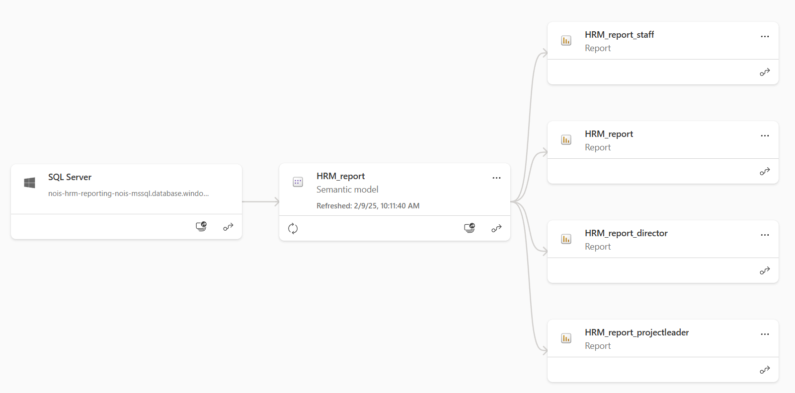
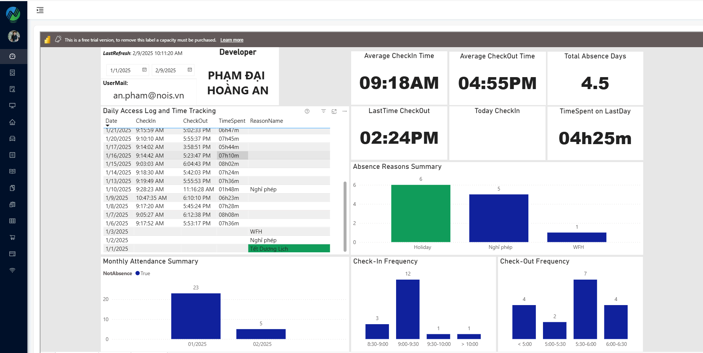
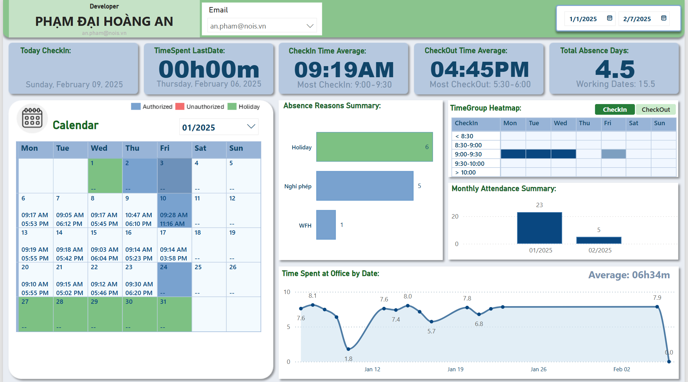

# Introduction

Designed an interactive Power BI dashboard to visualize workforce metrics, performance trends, and employee retention. The report provided real-time insights for HR stakeholders, improving decision-making and workforce planning.

# Step By Step

1. Connect Power BI Data Model to SQL Server
2. Design Data Model Architecture
3. Create Dashboard Visualizations
4. Implement Row-Level Security (RLS) Based on User Email
5. Publish to Power BI Workspace and Integrate with Website

# Result
The project has successfully integrated the Human Resource Management Power BI report with the company’s internal website, allowing users to access HR insights seamlessly.

**First Version:**  The first version focused on establishing a stable connection between Power BI and the website, providing essential metrics such as employee attendance, working hours, and project contributions while ensuring data security through Row-Level Security (RLS) based on user emai.

**Latest Version:** The dashboard has been enhanced with a more visually appealing and intuitive design, incorporating improved charts, KPIs, and filters for better readability and user experience. These updates make the dashboard more interactive, responsive, and effective in delivering valuable HR analytics.

# Contribute
* **An Pham** - Data Analyst - [AnNePDHA](https://github.com/AnNePDHA)
  * Collaborated with HR stakeholders to gather requirements and ensure the report aligned with business needs, delivering a user-centric solution
  * Designed and developed an interactive Power BI report that allows HR teams to visualize key metrics such as employee performance, turnover rates, and recruitment trends while ensuring data security through Row-Level Security (RLS) based on user roles and email authentication
  * Implemented data transformation and modeling using SQL Server, ensuring accurate and efficient data processing for the report.
  * Automated report deployment and updates using Azure DevOps, reducing manual effort and ensuring timely delivery of insights.
